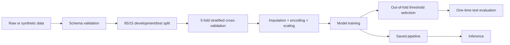

# Fraud Detection

An end-to-end **binary classification** project that predicts **fraud vs. non-fraud** in financial transactions. It demonstrates a reproducible ML workflow for imbalanced data: validated collection, in-pipeline feature engineering and preprocessing, cross-validation, untouched-test evaluation, threshold selection, error analysis, and saved-model inference.

## Problem

Fraud detection is difficult because fraud is rare, false positives inconvenience legitimate customers, false negatives create financial loss, and fraud patterns can drift. Accuracy is therefore misleading: a classifier that labels every transaction as non-fraud reaches 99% accuracy on this dataset while detecting no fraud.

The project prioritizes fraud-class **precision**, **recall**, **F1**, **PR-AUC**, **ROC-AUC**, and the **confusion matrix**. PR-AUC is the main ranking metric because it focuses on the minority class.

## Dataset

The repository uses a reproducible synthetic dataset so it can be run without credentials or private financial data. The default experiment creates 50,000 transactions with 1% fraud and 12 raw features describing amount, time, recent activity, account age, card/channel, location, authentication failures, merchant category, and historical spending.

The generator uses overlapping class distributions and swaps 10% of fraud labels with the same number of normal labels. This preserves prevalence while avoiding an unrealistically separable benchmark. The repository demonstrates methodology; it does not claim production fraud performance.

## Architecture



Feature engineering and preprocessing live inside the scikit-learn `Pipeline`, so the same transformations run during training and inference and are fitted only on training data.

## Data collection

[`src/data/collect.py`](src/data/collect.py) generates deterministic synthetic transactions or loads a CSV, then validates its schema, identifiers, timestamp, and binary target. A custom CSV must contain the same columns as the generated data. Missing feature values are accepted and handled by the preprocessing pipeline.

## Preprocessing

- Numeric features: median imputation and standardization.
- Categorical features: most-frequent imputation and one-hot encoding with unknown-category support.
- IDs, timestamps, and the target never enter the model.

## Feature engineering

Three domain features are derived in [`src/features.py`](src/features.py): transaction-to-historical-value ratio, suspicious-hour flag (00:00–06:59), and weekend flag. The transformer does not mutate its input.

## Class imbalance

The majority-class dummy classifier establishes the no-skill baseline. Logistic Regression and Random Forest use balanced class weights; Gradient Boosting receives balanced sample weights. No synthetic oversampling is used. Every probabilistic model is evaluated over out-of-fold thresholds from 0.10 to 0.90.

## Models

The experiment intentionally compares only four useful reference points:

1. Majority baseline
2. Logistic Regression
3. Random Forest
4. Gradient Boosting

The best model is selected by out-of-fold PR-AUC from five-fold stratified cross-validation. Its classification threshold maximizes out-of-fold F1, then the model is refitted on the full development set and evaluated once on the untouched test set.

## Evaluation and results

These results were produced by `python -m src.train --samples 50000` with seed 42, five-fold stratified cross-validation on 85% of the data, and a 15% test split (7,500 transactions, including 75 frauds).

| Model | Threshold | CV PR-AUC | Test precision | Test recall | Test F1 | Test PR-AUC | Test ROC-AUC |
|---|---:|---:|---:|---:|---:|---:|---:|
| Logistic Regression | 0.90 | 0.7166 | 0.7941 | 0.7200 | 0.7552 | 0.7877 | 0.9685 |
| Random Forest | 0.35 | 0.6820 | 0.7971 | 0.7333 | 0.7639 | 0.7882 | 0.9646 |
| Gradient Boosting | 0.90 | 0.6641 | 0.7162 | 0.7067 | 0.7114 | 0.7517 | 0.9662 |
| Majority baseline | 0.10 | 0.0100 | 0.0000 | 0.0000 | 0.0000 | 0.0100 | 0.5000 |

Cross-validation selected Logistic Regression at threshold **0.90**. Random Forest scored slightly higher on test PR-AUC and F1, but the test set did not participate in model or threshold selection. Full out-of-fold threshold tables and raw metrics are stored in [`results/`](results/).


## Error analysis

The selected model produced 7,411 true negatives, 14 false positives, 21 false negatives, and 54 true positives on the synthetic test set.

- A **false positive** can block a legitimate transaction, harm customer experience, and add review cost.
- A **false negative** lets fraud pass, creating financial and operational risk.

Optimizing F1 treats precision and recall symmetrically. A real deployment should select the threshold from business costs and capacity—for example, favoring higher recall when missed fraud is substantially more expensive than manual review.

## Running locally

```bash
python -m venv .venv
# Windows: .venv\Scripts\activate
# macOS/Linux: source .venv/bin/activate
pip install -r requirements.txt
python -m src.train
```

To train from a compatible CSV:

```bash
python -m src.train --data path/to/transactions.csv
```

Training writes the selected pipeline to `models/fraud_model.joblib` and evaluation artifacts to `results/`. Model binaries and input data are intentionally not committed.

For inference, provide a JSON array containing the 12 raw features:

```bash
python -m src.predict transactions.json
```

The output contains a binary `prediction` and `fraud_probability`. See [`src/data/collect.py`](src/data/collect.py) for the exact input field names.

## Tests and quality

```bash
pip install -r requirements-dev.txt
ruff check .
python -m pytest -q
```

The 14 focused tests cover deterministic collection, class overlap, imbalance, missing values, unknown categories, feature calculations, split proportions, cross-validation coverage, artifact selection, model loading, inference shape, and invalid inputs. GitHub Actions runs Ruff and pytest on pushes and pull requests.

## Project structure

```text
.
├── .github/workflows/tests.yml
├── models/                    # generated model (ignored)
├── notebooks/exploratory_analysis.ipynb
├── results/                   # metrics and evaluation plots
├── src/
│   ├── data/collect.py
│   ├── config.py
│   ├── evaluate.py
│   ├── features.py
│   ├── predict.py
│   ├── preprocessing.py
│   └── train.py
├── tests/
├── requirements.txt
└── requirements-dev.txt
```

## Limitations

- Synthetic data remains easier than production transaction streams, so these scores should not be interpreted as production readiness.
- The generated timestamp is not tied to behavioral drift; a random stratified split is appropriate here, while real temporal data should use chronological validation and backtesting.
- Fraud prevalence, feature availability, and error costs differ by institution and market.
- The model is not calibrated, monitored for drift, or evaluated for fairness.
- Threshold choice depends on business costs and review capacity, not metrics alone.

## Future work

The next valuable step is evaluation on a representative time-ordered dataset with cost-based threshold selection and drift monitoring. An API or Docker image should be added only when the model needs to be served; they do not improve the current ML evidence.

## License

MIT — see [`LICENSE`](LICENSE).
